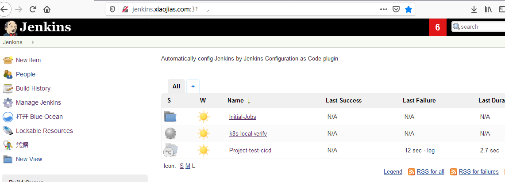
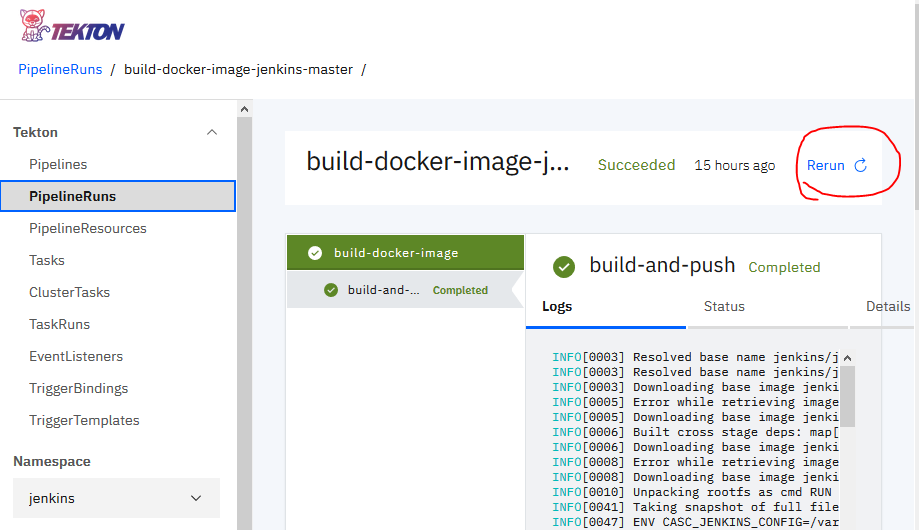
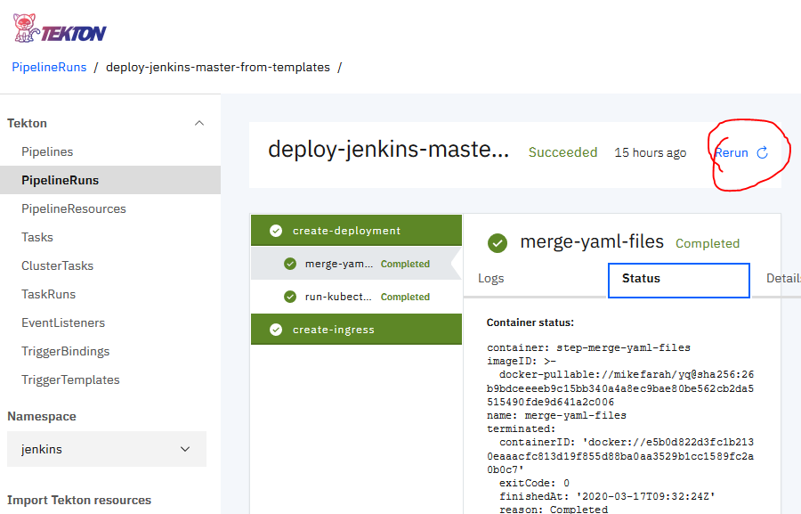

# Make Jenkins Everything as Code

## Goals

- Setup Jenkins instance on Kubertenes cluster;
- Apply basic Instance configuration, jobs, pipelines and enhancement;
- Isolate the human-readable configuration files and installation process/scripts;
- Customize instance configuration, job, pipeline, plugins(to **Everything** ideally) as Code based on Templates;
- Manage the Codes on github;
- Automate the processes and apply them via Continuous Delivery tool/s (e.g Tekton pipeline, etc);
- (TBC)

## Test Environment

- Kubernetes cluster hosted on 1-node;
- Tekton pipeline installed;
- (TBC)

## Workouts

- Easily setup Jenkins instance with initial configurations and enhancement; 
- Automate the deployment and apply it via Tekton pipeline;
- Clicking **ONE-Button** to customize your instance; 
- Clicking **ONE-Button** can rebuild your Jenkins environment with configurations; 
