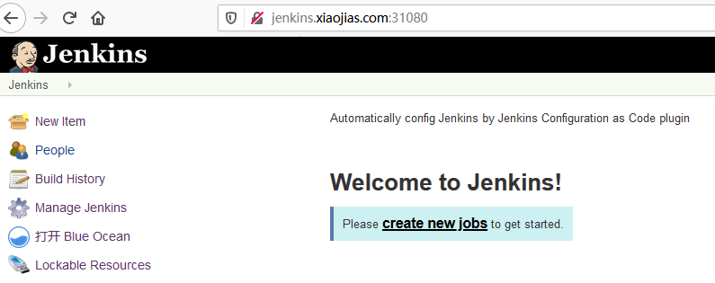
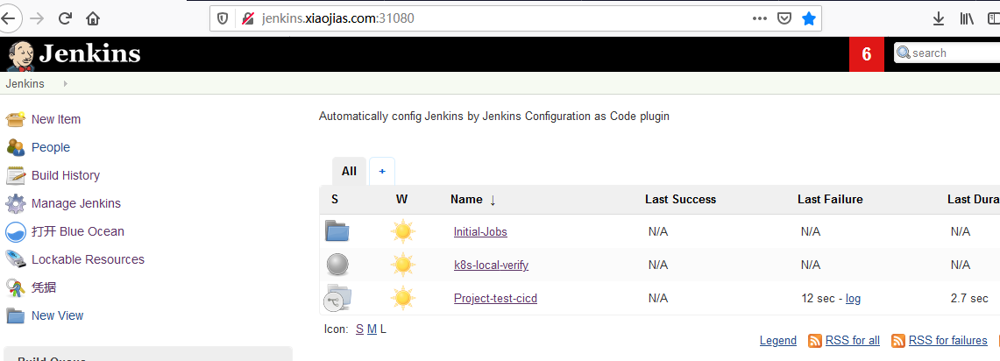

# Environments
- Kubernetes cluster is setup in one node;
- Ingress controller is installed; (Optional)
- Details:
```bash
# docker --version
Docker version 19.03.5, build 633a0ea

# kubectl version
Client Version: version.Info{Major:"1", Minor:"17", GitVersion:"v1.17.2", GitCommit:"59603c6e503c87169aea6106f57b9f242f64df89", GitTreeState:"clean", BuildDate:"2020-01-18T23:30:10Z", GoVersion:"go1.13.5", Compiler:"gc", Platform:"linux/amd64"}
Server Version: version.Info{Major:"1", Minor:"15", GitVersion:"v1.15.7", GitCommit:"6c143d35bb11d74970e7bc0b6c45b6bfdffc0bd4", GitTreeState:"clean", BuildDate:"2019-12-11T12:34:17Z", GoVersion:"go1.12.12", Compiler:"gc", Platform:"linux/amd64"}

# kubectl get nodes
NAME     STATUS   ROLES    AGE   VERSION
ecs-00   Ready    master   33d   v1.15.7

# kubectl -n kube-system get deployment
NAME                       READY   UP-TO-DATE   AVAILABLE   AGE
coredns                    2/2     2            2           33d
nginx-ingress-controller   1/1     1            1           26d

```

# Progress
## Phase 1
**Goals:**
- Setup Jenkins instance;
- Create initial jobs;
- Manage the configurations in github;
- Can apply further configurations; 
- The instance can be re-built relies on the configurations.

**Steps:**
1. Setup Jenkins instance
```bash
# ./deploy.sh
```

2. Export service by either way below:   
If your ingress controller is working:
Update value for 'basic-auth-secret' in ingress/ingress.yaml, and then perform command:
```bash
# kubectl apply -f ingress/ingress.yaml
```
otherwise:
```bash
kubectl apply -f master/service-nodeport.yaml
```

3. Access Jenkins UI
Dashboard will look like below:


4. Apply further configuration

```bash
# ./load-file-as-code.sh ./casc_configs/

```
5. Login Jenkins UI to apply new configurations
Login Jenkins UI, open "Manage Jenkins", select "Congifuration as Code", and then click "Apply new Configuration" button.
Dashboard of Jenkins UI will becomes below:


**Success.**

## Phase 2 (TBD)
**Goals:**


